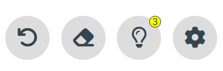

# SIMPLE SUDOKU GAME

## About The Project
* Since I've started learning ReactJS just recently I've used vanilla JS and CSS for this project, cause I feel more comfortable with it now.

* I didn't add a **game pause button**, cause I think a pause button in a sudoku game is kinda useless.
* **High score** system is based on the number of hints used, time taken & mistakes made.
* You can loose the game either by exceesing **mistake limits** (you can set the limit), or by exceeding **time limit** (which is fixed at 1 hour).
* **ENJOY THE GAME**

* Here is the link for the sudoku website: [SUDOKU](https://navthejb.github.io/Sudoku_game/)
* ( site link : https://navthejb.github.io/Sudoku_game/ )

## To run the game,
* create a folder inside VS code
* In that folder, create to more folders called images and icons, and copy the contents inside both folders from GitHub to VScode.
* create 3 new files inside the main folder in the name of **index.html**, **styles.css** and **app.js** and run the html code.

 
 
## Light/Dark Mode Toggle

Toggle between light and dark modes using the toggle button on top-right.
I chose to not go for system default mode, cause I think default doesn't matter for games. I prefer switching between mode easily.

Light Mode: 

Dark Mode:  

## Game History

## Game History Expanded

Using the " ▶️ " button you can see more details about the recent games you played

## Menu Option

There is a menu including : UNDO, ERASE, HINT, SETTINGS

Inside settings menu, you csn decide the amount of hints and mistakes (You can use any number hints although only 9 can be set at a time).

